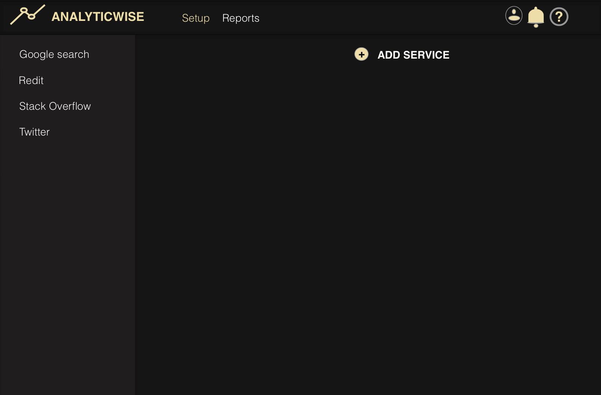

Analyticwise
> __We take pride in impeccable analytics__


 

Analyticwise is a webapp that dedicates it's functionality to produce a reliable data for each user in their chosen source of online activies. It does so by using chartist.js and Dygraphs tools to visualize data for users. 
It allows users to easily add or remove source, and the posibilities to download or erase their data. The app also has the feature where a user can set up a limit for one or each of their chosen sources. A warning will be send if the limit is about to be reached or a notification that the limit has been reached if it is reached. 


### Prerequisites


* npm
```sh
npm install npm@latest -g
```

## Usage example




## Development setup

  * Work in progress

```sh
make install
npm test
```

## Release History

* 0.0.1
    * Work in progress

## Meta

Spencer Saleban – [@spencersaleban](https://spencersaleban.com) – spencer@spencersaleban.com 

## Contributing

1. Fork it (<https://github.com/yourname/yourproject/fork>)
2. Create your feature branch (`git checkout -b feature/fooBar`)
3. Commit your changes (`git commit -am 'Add some fooBar'`)
4. Push to the branch (`git push origin feature/fooBar`)
5. Create a new Pull Request


